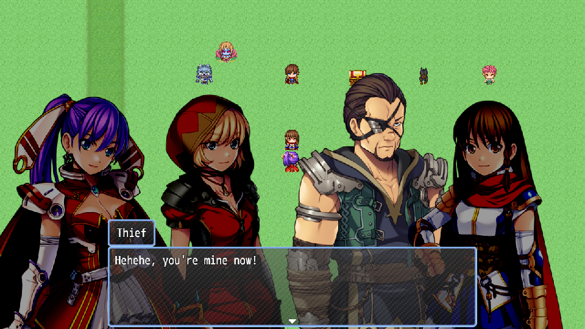
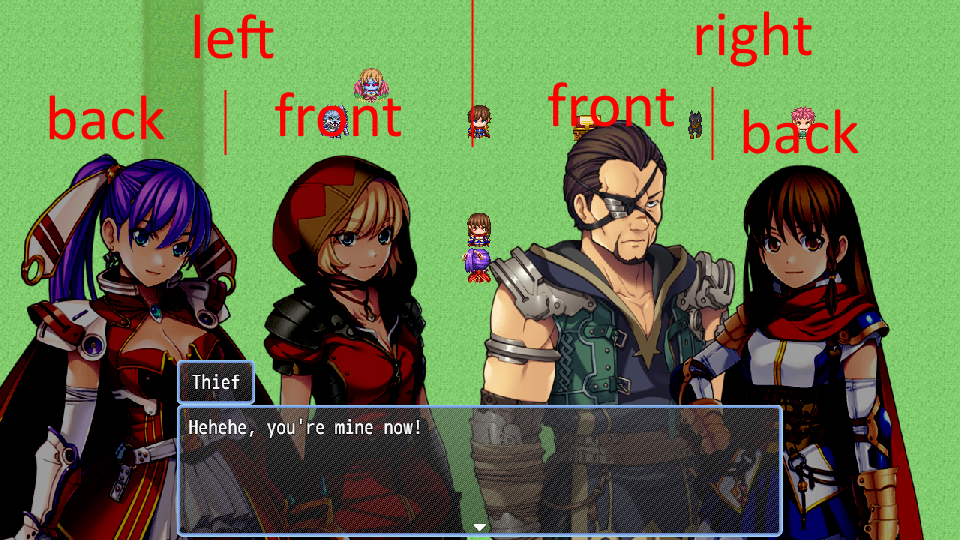
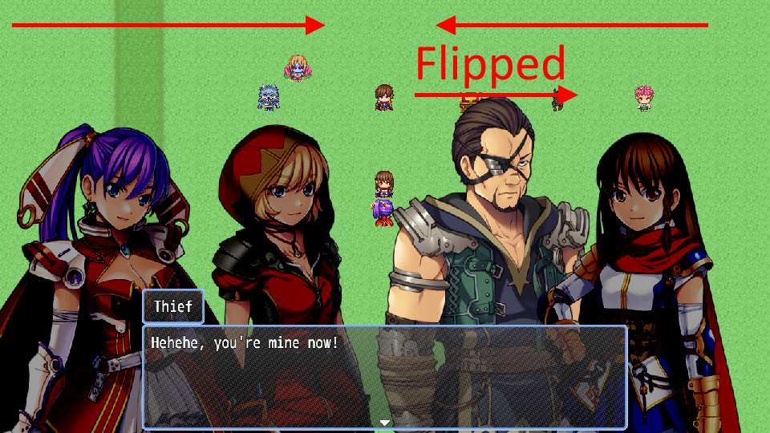

# N_BustDialog
Lets you use busts for dialogs instead of faces.

| Project      | Latest release      |
| ------------ | ------------------- |
| N_BustDialog | [Download][release] |

[All RPG Maker plugins by Nolonar][hub]

## How to use
1. Use `Add actor` plugin command to add a bust. Ensure that each bust has its own unique name. If a bust with the same name has already been added, the new bust will not be added. You must remove the bust or clear all busts before you can add the new one.
  - (New in 1.1.0) Alternatively, you can use the `Add actor from variable` plugin command to add a bust whose name is stored in a variable. Useful if the player can choose their playable character. To store the bust name in a variable, use the `Control Variables` event command with the `Script` operand, and enter `"[name of bust]"`. For example, if your bust is called `Alex.png`, the script should be `"Alex"`.
2. (optional) Use `Move actor` plugin command to have a bust move to a new position. The name must match the one defined when adding the bust.
3. (optional) Use `Remove actor` plugin command to get rid of a specific bust. The name must match the one defined when adding the bust.
4. (optional) (New in 1.1.0) Use `Replace actor bust` plugin command to replace an actor's bust with another one. Useful if you have multiple busts for the same character depicting different emotions.
  - Alternatively, you can use the `Replace actor bust from variable` plugin command to replace an actor's bust with another one whose name is stored in a variable.
5. (optional) Use `Clear` plugin command to remove all busts.

The busts will automatically be cleared when the event ends, so there's no need to use the `Clear` plugin command unless you want to clear early.

As mentioned above, the name of a bust must be unique (no 2 busts can have the same name). This is important for the following reasons:
- This allows you to manipulate busts after adding them in, e.g. to remove individual busts, move them, or replace them with another bust.
- This allows the plugin to manage bust tint. When text is displayed with a name, the plugin will match the text name with the busts and highlight the bust with matching name (all busts whose name don't match will be darkened).
  - You can disable this "Auto-highlight" feature by using the `Disable Auto-highlight` plugin command. Once disabled, you can re-enable it using the `Enable Auto-highlight` plugin command.
  - For better control over bust highlighting, use the `Highlight actor` and `Unhighlight actor` plugin commands.
- If for some reason you have multiple characters with the same name, you can use the following trick:
  - Use the `\n[n]`, `\p[n]`, or `\v[n]` control character. E.g. if Actor 5 and Actor 6 have the same name, use `\n[5]` and `\n[6]` as bust names and names for the text message.

This plugin can display up to 7 busts: 1 per side and position.
- There are 3 sides:
  - Left
  - Right
  - (New in 1.1.0) Neutral
- and 3 positions per side (except Neutral side, which only has 1 position):
  - Back
  - Front
  - (New in 1.1.0) Center

If you add or move a bust to a side and position that is already occupied by another bust, the old bust will be hidden until the new bust is removed or moves away, or the old bust is moved to any side/position.

By default, the busts will be facing the center of the screen, but can be flipped to face the edge instead:

For this to work properly, the plugin needs to know the busts' alignment, i.e. whether the bust images are left-facing or right-facing.
- Left-facing means the bust is looking to the left. In the above screenshot, there is 1 left-facing busts.
- Right-facing means the bust is looking to the right. In the above screenshot, there are 3 right-facing bust.
- (New in 1.1.0) Neutral means the bust is looking directly at the player.

The alignment can only be set plugin-wide, so all busts must be facing the same direction. The plugin will automatically flip them according to their side and whether they're supposed to be flipped.

This plugin will automatically change the tone of the busts depending on whether they're talking or not. For this to work, the name for the `Show Text...` event command must match the one defined when adding the bust.

## Compatibility
Tested and confirmed working:
- RPG Maker MZ

## Terms of Use
According to [LICENSE](LICENSE).

  [hub]: https://github.com/Nolonar/RM_Plugins
  [release]: https://github.com/Nolonar/RM_Plugins-BustDialog/releases/latest/download/N_BustDialog.js
